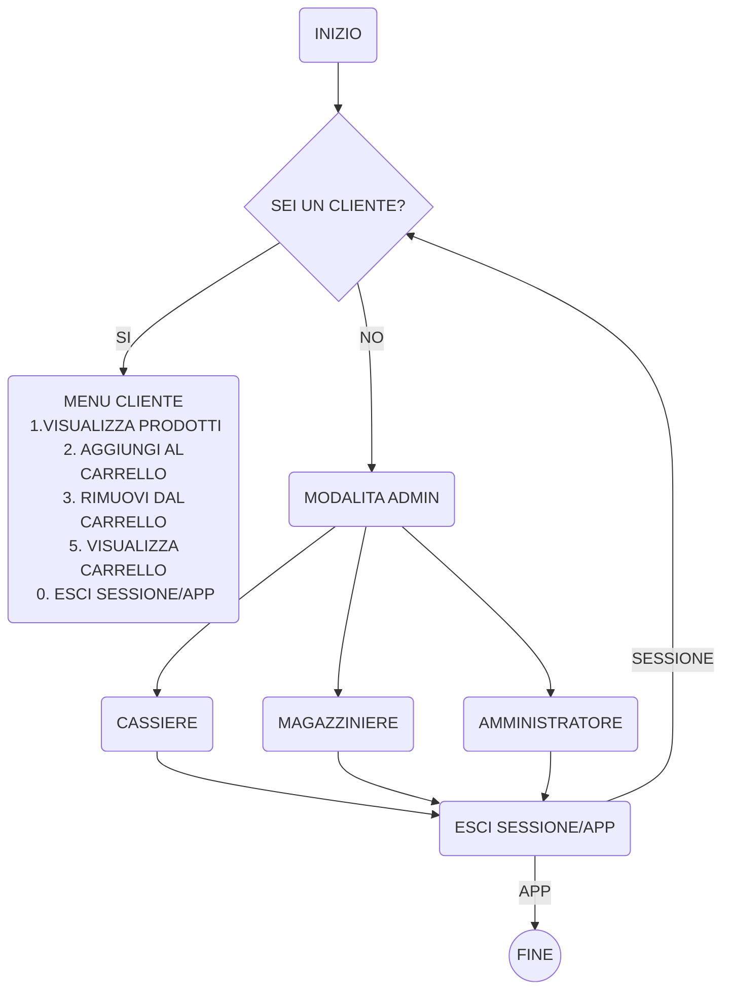

# SUPERMERCATO ADVANCED

Implementare le entita che compongono un supermercato.

---

|Dipendente|Tipo di dato|Note|
|---|---|---|
|ID|Int|viene generato in automatico con un progressivo|
|username|String|viene assegnato dall admin|
|ruolo|String|viene assegnato dall admin e puo essere cassiere o magazziniere|

|Cliente|Tipo di dato|Note|
|---|---|--|
|ID|int|viene generato in automatico con un progressivo|
|username|String|ognuno decide come vuole farlo|
|carrello|Prodotto[]||
|storico_acquisti|Purchases[]|viene popolato al termine di ogni acquisto|
|percentuale_sconto|int|viene incrementata a seconda del valore dello storico degli acquisti|

|Prodotto|Tipo di dato|Note|
|---|---|---|
|ID|int|viene generato in automatico con un progressivo|
|nome|String|viene inserito dal magazziniere|
|prezzo|double|viene inserito dal magazziniere|
|giacenza|int|viene inserito dal magazziniere|

**Purchases è lo stato nel quale si trova l acquisto di un cliente. Prima di essere passato alla cassa**

- Quando viene passato allo stato `completato` la cassa puo processare lo scontrino.

|Purchases|Tipo di dato|Note|
|---|---|---|
|ID|int|viene generato in automatico con un progressivo|
|cliente|Cliente||
|prodotti|Prodotto[]|viene inserito dal cliente|
|quantita|int|viene inserita dal cliente|
|data|Date|viene generato in automatico con la data corrente (quando il cliente completa l acquisto)|
|stato|Bool|lo stato di un acquisto di default e `in corso` e puo essere modificato dal cliente in `completato` o `annullato`|

|Cassa|Tipo di dato|Note|
|---|---|---|
|ID|int|viene generato in automatico con un progressivo|
|dipendente|Dipendente|
|acquisti|Purchases[]|
|scontrino_processato|Bool|di default e `false` e diventa `true` quando la cassa ha processato lo scontrino|

**Ruoli (che sarebbe il menu):**

|Cassiere|Magazziniere|Amministratore|Cliente|
|---|---|---|---|
|puo registrare i prodotti acquistati da un cliente che ha degli acquisti in stato completato e calcolare il totale da pagare generando lo scontrino.|puo visualizzare aggiungere modificare o rimuovere prodotti dal magazzino.|puo visualizzare ed impostare il ruolo dei dipendenti.|Può aggiungere o rimuovere prodotti e cambiare lo stato dell ordine|


---

# Stato dell'ultimo commit:

---

## Implementazioni:
- [x] Gestione generale del menu, passaggio da una modalità all'altra, gestione uscita dall'app
- [x] `CarrelloRepository` carica e salva correttamente sul file `json` (serialize, deserialize)
- [x] Logica di decremento giacenza e corretto aggiornamento dei repository di `Purchase.Json` e dei json in  `/catalogo`
- [x] Commenti completati su `CarrelloRepository.cs`
- [x] Commenti completati su `CarrelloAdvancedManager.cs > AggiungiProdotto`
- [x] Gestione del carello attraverso `CarrelloAdvancedManager` e `CarrelloRepository`
- [x] Visualizzazione del carrello (Qnt. - Nome - Prezzo)
- [x] Correzione bug 'condivisione giacenza tra carrello e catalogo'

## Obiettivi individuati (in aggiornamento):


- [ ] Generare nella cartella `/Carrello` un file Json `Stato Del Carrello.json` con stringa `"In Corso"` come default.

in `CarrelloAdvancedManager.cs`
- [ ] correggere `public void EliminaProdotto` 
    - deve prendere come argomento `NomeProdotto`
    - deve riaggiungere la quantità alla giacenza
- [ ] correggere `public void AggiornaProdotto` 
    - deve prendere come argomento `NomeProdotto`
    - deve poter modificare la quantità
    - deve riaggiungere la quantità alla giacenza
    - in caso la nuova quantità sia zero deve eliminare la voce da `Purchase.json`

    ## Prossime implementazioni 
- Creare un oggetto `Cliente cliente` e associargli un carrello `cliente.Carrello` che rispecchia `Carrello.json` 
- Acquisire lo `clente.Username` 


> Commit
```bash
git add --all
git commit -m "Supermercato Avanzato 2/10 - prime implementazioni"
git push -u origin main
```

## Implementazioni:

in `class Cliente`
- [x] Creare un oggetto `Cliente cliente` e associargli un carrello `cliente.Carrello` che rispecchia `Carrello.json` 
- [x] Acquisire lo `clente.Username` 
- [x] Ottimizzazione della leggibilità del codice nel menu cliente + commenti completi 

## Obiettivi individuati (in aggiornamento):

Il file Purchase.json deve avere:
- [ ] un `purchaseIdProgressivo` generato da una classe manager
- [ ] una variabile `bool` di `stato`
- [ ] ora e data del momento in cui `stato` passa da `false` a `true`, ovvero quando viene completato l'acquisto

Creare una classe `ClientiAdvancedManager`
- [ ] calcola `clienteIdProgressivo`, 
- [ ] tiene traccia e ricalcola `PercentualeDiSconto`
- [ ] controllo dell'username
    - se username già nel database, carica dati di quel cliente
    - se non esiste, crearne uno nuovo. 

In `CarrelloAdvancedManager.cs`:
- [ ] correggere `public void EliminaProdotto` 
    - deve prendere come argomento `NomeProdotto`
    - deve riaggiungere la quantità alla giacenza
- [ ] correggere `public void AggiornaProdotto` 
    - deve prendere come argomento `NomeProdotto`
    - deve poter modificare la quantità
    - deve riaggiungere la quantità alla giacenza
    - in caso la nuova quantità sia zero deve eliminare la voce da `Purchase.json`

> Commit
```bash
git add --all
git commit -m "Supermercato Avanzato 2/10 - implementazione classe cliente"
git push -u origin main
```


