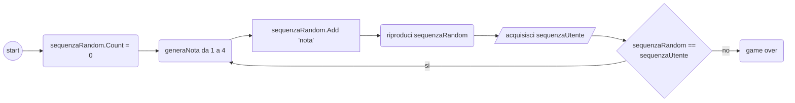
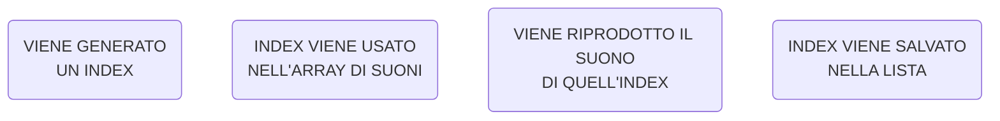

# SIMON (Gioco musicale)

#### OBIETTIVO:
Creare un gioco come il popolare Simon! 4 colori, 4 note musicali della scala pentatonica

---

---

Cosa occorre:
- un generatore Random da 0 a 3
- un array di 4 suoni
- una variabile per scrivere e leggere la sequenza (lista)

Processo:

